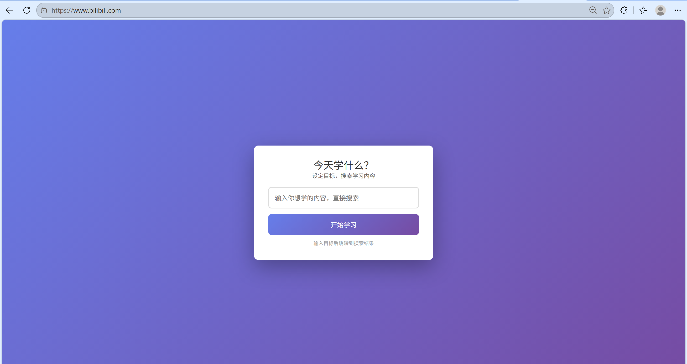

# 信息源过滤器 (Info Filter)

在 B站 / YouTube 首页拦截算法推荐，强制设定学习目标后跳转搜索结果，帮你在视频平台保持专注。

## 效果预览

> 打开 bilibili.com / YouTube → 弹出目标输入框 → 不设定看不到任何推荐内容

每日报告功能通过 `chrome-extension://.../report.html` 查看。

## 功能

- **首页拦截**：打开 bilibili.com / YouTube 时弹出学习目标输入框，不设定目标看不到任何推荐内容
- **搜索结果保留**：输入目标后自动跳转搜索结果页，仅隐藏侧边栏推荐
- **视频页无干扰**：视频页不做任何隐藏，评论保留可查看
- **访问记录**：记录当日访问的页面和停留时长
- **每日报告**：查看学习目标、访问统计和跳过记录

## 安装

### 开发者模式安装

1. 下载代码到本地或 clone 仓库
2. 打开 Chrome → `chrome://extensions`
3. 开启"开发者模式" → "加载已解压的扩展程序"
4. 选择 `info-filter-extension` 文件夹

### 发布到 Chrome Web Store

1. 打包：在 `chrome://extensions` 点击"打包扩展程序"
2. 选择项目根目录和 `.pem` 私钥文件
3. 上传 `.zip` 到 Chrome Web Store

## 技术架构

- **content.js** — 核心逻辑：nuclear CSS hide + cover 防闪烁、SPA pushState 拦截、DOM 覆盖层注入
- **storage.js** — chrome.storage.local 封装，按日期分片存储，自动清理过期数据
- **background.js** — Service worker，处理跨页面停留时长持久化
- **popup.html/js** — 弹出窗口，展示当日目标和统计
- **report.html/js** — 每日报告页，查看完整学习记录

## 隐私

纯本地存储（`chrome.storage.local`），无后端、无数据上传。
